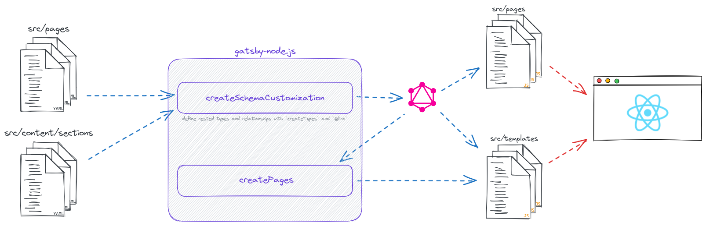

# STAR Website

This repository houses the code for the website for RENCI's STAR Programs. It's a [React](https://react.dev/) app built with [Gatsby](https://www.gatsbyjs.com/).

## 🚧 Development

### Getting Started

After cloning this repository, execute `npm i` to install dependencies and `npm start` to spin up a local development server on port 8000.

### Content Sourcing

For every "Section" React component in `src/components/sections` there exists a corresponding YAML content file in `src/content/sections` with the data that component is expected to consume.

All content queries are orchestrated and dispersed into Section components via the `useSectionContent` hook, to which the PascalCase section name is provided. For example, "AboutStar" grabs its content with the following line in `src/content/sections/about-star.js`.
```
const content = useSectionContent('AboutStar')
```

## 🗄 Content Management

### Content as YAML

There are two different types of content: Pages and Sections. Both exist in the form of YAML files. Pages provide metadata (like page title, description, and path), hero details (bg image, title, blurb), and the sections to stack onto that page. Sections have content specific to their purpose.

#### Pages

Page YAML files in the `src/pages` directory and have the following fields available.

| Field                          | Type     | Required? | Usage                                |
|--------------------------------|----------|-----------|--------------------------------------|
| **title**                      | string   |    ✅     | window title & seo title             |
| **description**                | string   |    ❌     | seo description                      |
| **path**                       | string   |    ✅     | route to access page                 |
|||||
| **hero**                       | obj      |    ❌     | decorative section at top of page    |
| hero.background_image_path     | string   |    ✅     | - image for hero background          |
| hero.title                     | string   |    ✅     | - large main hero text               |
| hero.blurb                     | string   |    ✅     | - medium hero subtitle               |
| **sections**                   | [string] |    ✅     | `section_id`s of the sections to render on the page |

##### Example Page

```yaml
# src/pages/some-page.yaml
title: Some Page
path: /path/to/some-page
description: Incididunt laborum culpa tempor sunt nostrud laborum qui id officia.
hero:
  backgroundImagePath: "../images/some-page-hero.jpg"
  title: Welcome to Some Page!
  blurb: >
    Lorem ipsum tempor pariatur amet anim excepteur veniam sit enim sit nisi culpa proident excepteur eiusmod aliqua ut. Lorem ipsum proident sed esse sit adipisicing sit tempor incididunt deserunt id magna ut ut in labore et est.
sections:
  - section-name-1
  - section-name-2
  - section-name-3
```

#### Sections

Each of the sections appearing in a page's `sections` array must reference a YAML file of the same name in `src/content/sections`. For example, the content for the `project-showcase` section lives in `src/content/sections/project-showcase.yaml`.

Unlike pages, each section file (`src/content/sections/*.yaml`) has its own unique set of fields available. For now, we'll have to dig into the code to see what's available.

#### Theme

The site-wide config (read: theme content) also lives as YAML in `src/content/theme/index.yaml`, and the following confirugations are available.

| Field                | Type    | Required? | Usage                       |
|----------------------|---------|-----------|-----------------------------|
| **metadata**         | obj     |    ✅     |                             |
| metadata.title       | string  |    ✅     | window title & seo title    |
| metadata.description | string  |    ✅     | seo description             |
| metadata.site_url    | string  |    ❌     |                             |
|||||
| **navigation**       | [link]  |    ✅     | main menu items to render   |
|||||
| link                 | obj     |           |                             |
| link.label           | string  |    ✅     | menu link text label        |
| link.path            | string  |    ✅     | path to link to             |
|||||
| **footer**           | obj     |           |                             |
| footer.copyright     | string  |    ✅     | text after copyright notice |

##### Example Theme

```yaml
metadata:
  title: STAR
  description: RENCI'S STAR Programs
  site_url: https://star.renci.org/
navigation:
  - label: Students
    path: /students
  - label: Staff
    path: /staff
  - label: Positions
    path: /positions
footer:
  copyright: RENCI
```

### Image Content

Images can be referenced and used in content YAML files by providing the path relative to the `src/content/images` directory. Simplest is probably to put images in that directory and set the YAML fields to just their filenames.

## 🌊 Data Flow

Understanding how data moves around at build- and run-time in a Gatsby application can be tricky. This diagram aims to bring clarity to our situation---that is, how YAML (pages and sections) end up as content to be consumed by our application.



### Brief Overview

Everything begins with YAML files (in `src/pages` and `src/content/sections`), which get processed by Gatsby's build process. This process is customized in `gatsby-node.js`, where we explicitly define some types and relations with `createSchemaCustomization`. This is important for querying said data and relationships in our GraphQL database. In `gatsby-node.js`, we query this data for page content (`PagesYaml`) and pass the path and section IDs to the template page's context. The template (in `src/templates`) then can pull in the appropriate sections client-side via the `useSectionContent` hook, which simply implements Gatsby's `useStaticQuery`. Non-template pages (JavaScript files in `src/pages/`) also have access to this content.
